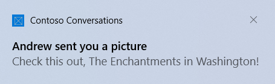
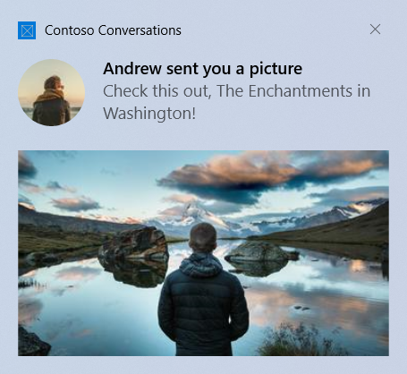
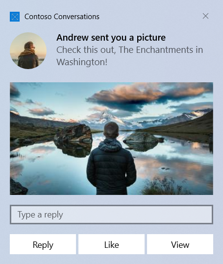

# Send a local notification from C# apps


A notification is a message that an app can construct and deliver to the user while they are not currently inside your app. This Quickstart walks you through the steps to create, deliver, and display a Windows 10 notification with the new adaptive templates and interactive actions. These actions are demonstrated through a local notification, which is the simplest notification to implement.


## Step 1: Install NuGet package

Install the **unlisted** [Reunion NuGet package](https://www.nuget.org/packages/aleader.Reunion/). Note you must use the Package Manager Console to install it as it's unlisted and won't be installable from the UI. This package allows you to generate notifications via objects instead of raw XML. And for Win32 apps, it also allows you to use notifications from non-UWP apps.

1. In Visual Studio, with your project open, go to `Tools -> NuGet Package Manager -> Package Manager Console`
1. Ensure your correct project is selected for "Default project"
1. Execute `Install-Package aleader.Reunion -Version 7.0.0-build.205.gf55c49e8d8`

> [!IMPORTANT]
> .NET Framework Win32 apps that still use packages.config must migrate to PackageReference, otherwise the Windows 10 SDKs won't be referenced correctly. In your project, right-click on "References", and click "Migrate packages.config to PackageReference".
> 
> .NET Core 3.0 WPF apps must update to .NET Core 3.1, otherwise the APIs will be absent.


## Step 2: Add namespace declarations

```csharp
using Microsoft.UI.Notifications; // Reunion library
```


## Step 3: Send a notification

In Windows 10, your notification content is described using an adaptive language that allows great flexibility with how your notification looks. See the [notification content documentation](adaptive-interactive-toasts.md) for more information.

We'll start with a simple text-based notification. Construct the notification content (using the [Reunion library](https://www.nuget.org/packages/aleader.Reunion/)), and show the notification!




```csharp
// Construct the content and show the notification!
new NotificationBuilder()
    .SetLaunchArgs("picOfHappyCanyon")
    .AddText("Andrew sent you a picture")
    .AddText("Check this out, Happy Canyon in Utah!")
    .Show();
```

> [!IMPORTANT]
> Win32 non-MSIX/sparse apps must use the **Show** method as seen above. If you use **ToastNotificationManager** itself, you will receive an element not found exception. All types of apps can use the Show method and it will work correctly.


## Step 4: Handling activation

The steps for handling activation differ for UWP, Win32 MSIX, and Win32 or sparse apps.


#### [UWP](#tab/uwp)

When the user clicks your notification (or a button on the notification with foreground activation), your app's **App.xaml.cs** **OnActivated** will be invoked.

**App.xaml.cs**

```csharp
protected override void OnActivated(IActivatedEventArgs e)
{
    // Handle notification activation
    if (e is ToastNotificationActivatedEventArgs toastActivationArgs)
    {
        // Obtain the arguments from the notification
        string args = toastActivationArgs.Argument;

        // Obtain any user input (text boxes, menu selections) from the notification
        ValueSet userInput = toastActivationArgs.UserInput;
 
        // TODO: Show the corresponding content
    }
}
```

> [!IMPORTANT]
> You must initialize your frame and activate your window just like your **OnLaunched** code. **OnLaunched is NOT called if the user clicks on your toast**, even if your app was closed and is launching for the first time. We often recommend combining **OnLaunched** and **OnActivated** into your own `OnLaunchedOrActivated` method since the same initialization needs to occur in both.

#### [Win32 MSIX](#tab/win32-msix)

First, in your **Package.appxmanifest**, add:

1. Declaration for **xmlns:com**
1. Declaration for **xmlns:desktop**
1. In the **IgnorableNamespaces** attribute, **com** and **desktop**
1. **desktop:Extension** for **windows.toastNotificationActivation** to declare your toast activator CLSID (using a new GUID of your choice).
1. MSIX only: **com:Extension** for the COM activator using the GUID from step #4. Be sure to include the `Arguments="-ToastActivated"` so that you know your launch was from a notification

**Package.appxmanifest**

```xml
<!--Add these namespaces-->
<Package
  ...
  xmlns:com="http://schemas.microsoft.com/appx/manifest/com/windows10"
  xmlns:desktop="http://schemas.microsoft.com/appx/manifest/desktop/windows10"
  IgnorableNamespaces="... com desktop">
  ...
  <Applications>
    <Application>
      ...
      <Extensions>

        <!--Specify which CLSID to activate when toast clicked-->
        <desktop:Extension Category="windows.toastNotificationActivation">
          <desktop:ToastNotificationActivation ToastActivatorCLSID="replaced-with-your-guid-C173E6ADF0C3" /> 
        </desktop:Extension>

        <!--MSIX only: Register COM CLSID LocalServer32 registry key (Sparse apps must omit this)-->
        <com:Extension Category="windows.comServer">
          <com:ComServer>
            <com:ExeServer Executable="YourProject\YourProject.exe" Arguments="-ToastActivated" DisplayName="Toast activator">
              <com:Class Id="replaced-with-your-guid-C173E6ADF0C3" DisplayName="Toast activator"/>
            </com:ExeServer>
          </com:ComServer>
        </com:Extension>

      </Extensions>
    </Application>
  </Applications>
 </Package>
```

Then, **in your app's startup code** (App.xaml.cs OnStartup for WPF), subscribe to the OnActivated event.

```csharp
// Listen to modern activation
AppLifecycle.OnActivated += e =>
{
    if (e is NotificationActivatedEventArgs notifArgs)
    {
        // Obtain the arguments from the notification
        string args = notifArgs.Argument;

        // Obtain any user input (text boxes, menu selections) from the notification
        ValueSet userInput = notifArgs.UserInput;
     
        // TODO: Perform the corresponding action
    }
}
```

> [!NOTE]
> The **OnActivated** event is not called on the UI thread. If you'd like to perform UI thread operations, you must call `Application.Current.Dispatcher.Invoke(callback)`.

When the user clicks any of your notifications (or a button on the notification), the following will happen...

**If your app is currently running**...

1. The **AppLifecycle.OnActivated** event will be invoked on a background thread.

**If your app is currently closed**...

1. Your app's EXE will be launched and `AppLifecycle.WasCurrentProcessActivated()` will return true to indicate the process was started due to a modern activation and that the event handler will soon be invoked.
1. Then, the 
 **AppLifecycle.OnActivated** event will be invoked on a background thread.


#### [Win32 or sparse](#tab/win32)

When the user clicks any of your notifications (or a button on the notification), the following will happen...

**If your app is currently running**...

1. The **AppLifecycle.OnActivated** event will be invoked on a background thread.

**If your app is currently closed**...

1. Your app's EXE will be launched and `AppLifecycle.WasCurrentProcessActivated()` will return true to indicate the process was started due to a modern activation and that the event handler will soon be invoked.
1. Then, the 
 **AppLifecycle.OnActivated** event will be invoked on a background thread.

**In your app's startup code** (App.xaml.cs OnStartup for WPF), subscribe to the OnActivated event.

```csharp
// Listen to modern activation
AppLifecycle.OnActivated += e =>
{
    if (e is NotificationActivatedEventArgs notifArgs)
    {
        // Obtain the arguments from the notification
        string args = notifArgs.Argument;

        // Obtain any user input (text boxes, menu selections) from the notification
        ValueSet userInput = notifArgs.UserInput;
     
        // TODO: Perform the corresponding action
    }
}
```

> [!NOTE]
> The **OnActivated** event is not called on the UI thread. If you'd like to perform UI thread operations, you must call `Application.Current.Dispatcher.Invoke(callback)`.

---


## Step 5: Handling uninstallation

#### [UWP](#tab/uwp)

You don't need to do anything! When UWP apps are uninstalled, all notifications and any other related resources are automatically cleaned up.

#### [Win32 MSIX](#tab/win32-msix)

You don't need to do anything! When MSIX apps are uninstalled, all notifications and any other related resources are automatically cleaned up.

#### [Win32 or sparse](#tab/win32)

If your app has an uninstaller, in your uninstaller you should call `AppLifecycle.Uninstall()`. If your app is a "portable app" without an installer, consider calling this method upon app exit unless you have notifications that are meant to persist after your app is closed.

The uninstall method will clean up any scheduled and current notifications, remove any associated registry values, and remove any associated temporary files that were created by the library.

---


## Activation in depth

The first step in making your notifications actionable is to add some launch args to your notification, so that your app can know what to launch when the user clicks the notification (in this case, we're including some information that later tells us we should open a conversation, and we know which specific conversation to open).

We recommend installing the [QueryString.NET](https://www.nuget.org/packages/QueryString.NET/) NuGet package to help construct and parse query strings for your notification arguments, as seen below.

```csharp
using Microsoft.QueryStringDotNET; // QueryString.NET

int conversationId = 384928;

// Construct the content
new NotificationBuilder()

    // Arguments returned when user taps body of notification
    .SetLaunchArgs(new QueryString() // Using QueryString.NET
    {
        { "action", "viewConversation" },
        { "conversationId", conversationId.ToString() }
    }.ToString())

    .AddText("Andrew sent you a picture")
    ...
```


Here are some more complex examples of handling activation...


#### [UWP](#tab/uwp)

**App.xaml.cs**

```csharp
protected override void OnActivated(IActivatedEventArgs e)
{
    // Get the root frame
    Frame rootFrame = Window.Current.Content as Frame;
 
    // TODO: Initialize root frame just like in OnLaunched
 
    // Handle toast activation
    if (e is ToastNotificationActivatedEventArgs toastActivationArgs)
    {            
        // Parse the query string (using QueryString.NET)
        QueryString args = QueryString.Parse(toastActivationArgs.Argument);
 
        // See what action is being requested 
        switch (args["action"])
        {
            // Open the image
            case "viewImage":
 
                // The URL retrieved from the toast args
                string imageUrl = args["imageUrl"];
 
                // If we're already viewing that image, do nothing
                if (rootFrame.Content is ImagePage && (rootFrame.Content as ImagePage).ImageUrl.Equals(imageUrl))
                    break;
 
                // Otherwise navigate to view it
                rootFrame.Navigate(typeof(ImagePage), imageUrl);
                break;
                             
 
            // Open the conversation
            case "viewConversation":
 
                // The conversation ID retrieved from the toast args
                int conversationId = int.Parse(args["conversationId"]);
 
                // If we're already viewing that conversation, do nothing
                if (rootFrame.Content is ConversationPage && (rootFrame.Content as ConversationPage).ConversationId == conversationId)
                    break;
 
                // Otherwise navigate to view it
                rootFrame.Navigate(typeof(ConversationPage), conversationId);
                break;
        }
 
        // If we're loading the app for the first time, place the main page on
        // the back stack so that user can go back after they've been
        // navigated to the specific page
        if (rootFrame.BackStack.Count == 0)
            rootFrame.BackStack.Add(new PageStackEntry(typeof(MainPage), null, null));
    }
 
    // TODO: Handle other types of activation
 
    // Ensure the current window is active
    Window.Current.Activate();
}
```

#### [Win32 MSIX / normal / sparse](#tab/win32-msix+win32)

```csharp
// Listen to activation
AppLifecycle.OnActivated += AppLifecycle_OnActivated;

private void AppLifecycle_OnActivated(IActivatedEventArgs e)
{
    Application.Current.Dispatcher.Invoke(delegate
    {
        if (e is NotificationActivatedEventArgs notifArgs)
        {
            // Tapping on the top-level header launches with empty args
            if (notifArgs.Argument.Length == 0)
            {
                // Perform a normal launch
                OpenWindowIfNeeded();
                return;
            }

            // Parse the query string (using NuGet package QueryString.NET)
            QueryString args = QueryString.Parse(notifArgs.Argument);

            // See what action is being requested 
            switch (args["action"])
            {
                // Open the image
                case "viewImage":

                    // The URL retrieved from the toast args
                    string imageUrl = args["imageUrl"] as string;

                    // Make sure we have a window open and in foreground
                    OpenWindowIfNeeded();

                    // And then show the image
                    (App.Current.Windows[0] as MainWindow).ShowImage(imageUrl);

                    break;

                // Background: Quick reply to the conversation
                case "reply":

                    // Get the response the user typed
                    string msg = notifArgs.UserInput["tbReply"] as string;

                    // And send this message
                    SendMessage(msg);

                    // If there's no windows open, exit the app
                    if (App.Current.Windows.Count == 0)
                    {
                        Application.Current.Shutdown();
                    }

                    break;
            }
        }
    });
}

private void OpenWindowIfNeeded()
{
    // Make sure we have a window open (in case user clicked toast while app closed)
    if (App.Current.Windows.Count == 0)
    {
        new MainWindow().Show();
    }

    // Activate the window, bringing it to focus
    App.Current.Windows[0].Activate();

    // And make sure to maximize the window too, in case it was currently minimized
    App.Current.Windows[0].WindowState = WindowState.Normal;
}
```

To properly support being launched while your app is closed, for WPF apps, in your `App.xaml`, **remove** the `StartupUri` property. Then, in your `App.xaml.cs` file, you'll want to override **OnStartup** method to determine whether you're being launched from a toast or not. If launched from a toast, `ToastNotificationManagerCompat.WasCurrentProcessToastActivated()` will return true. In that case, you should stop performing any normal launch activation, and allow your **OnActivated** code handle launching.

```csharp
protected override async void OnStartup(StartupEventArgs e)
{
    // Register activator
    ToastNotificationManagerCompat.OnActivated += Notification_OnActivated;

    // If launched from a toast
    if (ToastNotificationManagerCompat.WasCurrentProcessToastActivated())
    {
        // Our OnActivated callback code will run later
        // and will show a window if necessary.
    }

    else
    {
        // Show the window
        // In App.xaml, be sure to remove the StartupUri so that a window doesn't
        // get created by default, since we're creating windows ourselves (and sometimes we
        // don't want to create a window if handling a background activation).
        new MainWindow().Show();
    }
}
```

---


## Adding images

You can add rich content to notifications. We'll add an inline image and a profile (app logo override) image.

> [!NOTE]
> Images can be used from the app's package, the app's local storage, or from the web. As of the Fall Creators Update, web images can be up to 3 MB on normal connections and 1 MB on metered connections. On devices not yet running the Fall Creators Update, web images must be no larger than 200 KB.

> [!IMPORTANT]
> Http images are only supported in UWP/MSIX/sparse apps that have the internet capability in their manifest. Win32 non-MSIX/sparse apps do not support http images; you must download the image to your local app data and reference it locally.



```csharp
// Construct the content and show the toast!
new NotificationBuilder()
    ...

    // Inline image
    .AddInlineImage(new Uri("https://picsum.photos/360/202?image=883"))

    // Profile (app logo override) image
    .SetAppLogoOverride(new Uri("ms-appdata:///local/Andrew.jpg"), ToastGenericAppLogoCrop.Circle)
    
    .Show();
    
...
```


## Adding buttons and inputs

You can add buttons and inputs to make your notifications interactive. Buttons can launch your foreground app, a protocol, or your background task. We'll add a reply text box, a "Like" button, and a "View" button that opens the image.



```csharp
int conversationId = 384928;

// Construct the content and show the toast!
new NotificationBuilder()
    ...

    // Text box for replying
    .AddInputTextBox("tbReply", placeHolderContent: "Type a response")

    // Reference the text box's ID in order to place this button next to the text box
    .AddButton("tbReply", "Reply", ToastActivationType.Background, new QueryString()
    {
        { "action", "reply" },
        { "conversationId", conversationId.ToString() }
    }.ToString(), imageUri: new Uri("Assets/Reply.png", UriKind.Relative))

    .AddButton("Like", ToastActivationType.Background, new QueryString()
    {
        { "action", "like" },
        { "conversationId", conversationId.ToString() }
    }.ToString())

    .AddButton("View", ToastActivationType.Foreground, new QueryString()
    {
        { "action", "viewImage" },
        { "imageUrl", image.ToString() }
    }.ToString())
    
    .Show();
    
...
```

The activation of foreground buttons are handled in the same way as the main toast body (your App.xaml.cs OnActivated will be called).


## Handling background activation

#### [UWP](#tab/uwp)

When you specify background activation on your toast (or on a button inside the toast), your background task will be executed instead of activating your foreground app.

For more information on background tasks, please see [Support your app with background tasks](/windows/uwp/launch-resume/support-your-app-with-background-tasks).

If you are targeting build 14393 or higher, you can use in-process background tasks, which greatly simplify things. Note that in-process background tasks will fail to run on older versions of Windows. We'll use an in-process background task in this code sample.

```csharp
const string taskName = "ToastBackgroundTask";

// If background task is already registered, do nothing
if (BackgroundTaskRegistration.AllTasks.Any(i => i.Value.Name.Equals(taskName)))
    return;

// Otherwise request access
BackgroundAccessStatus status = await BackgroundExecutionManager.RequestAccessAsync();

// Create the background task
BackgroundTaskBuilder builder = new BackgroundTaskBuilder()
{
    Name = taskName
};

// Assign the toast action trigger
builder.SetTrigger(new ToastNotificationActionTrigger());

// And register the task
BackgroundTaskRegistration registration = builder.Register();
```


Then in your App.xaml.cs, override the OnBackgroundActivated method. You can then retrieve the pre-defined arguments and user input, similar to the foreground activation.

**App.xaml.cs**

```csharp
protected override async void OnBackgroundActivated(BackgroundActivatedEventArgs args)
{
    var deferral = args.TaskInstance.GetDeferral();
 
    switch (args.TaskInstance.Task.Name)
    {
        case "ToastBackgroundTask":
            var details = args.TaskInstance.TriggerDetails as ToastNotificationActionTriggerDetail;
            if (details != null)
            {
                string arguments = details.Argument;
                var userInput = details.UserInput;

                // Perform tasks
            }
            break;
    }
 
    deferral.Complete();
}
```

#### [Win32 MSIX / normal / sparse](#tab/win32-msix+win32)

For Win32 applications, background activations are handled the same as foreground activations (your **OnActivated** event handler will be triggered). You can choose to not show any UI and close your app after handling activation.

---


## Set an expiration time

In Windows 10, all toast notifications go in Action Center after they are dismissed or ignored by the user, so users can look at your notification after the popup is gone.

However, if the message in your notification is only relevant for a period of time, you should set an expiration time on the toast notification so the users do not see stale information from your app. For example, if a promotion is only valid for 12 hours, set the expiration time to 12 hours. In the code below, we set the expiration time to be 2 days.

> [!NOTE]
> The default and maximum expiration time for local toast notifications is 3 days.

```csharp
// Show a toast that expires in 2 days
new NotificationBuilder()
    .AddText("Expires in 2 days...")
    .SetExpirationTime(DateTime.Now.AddDays(2))
    .Show();
```


## Provide a primary key for your toast

If you want to programmatically remove or replace the notification you send, you need to use the Tag property (and optionally the Group property) to provide a primary key for your notification. Then, you can use this primary key in the future to remove or replace the notification.

To see more details on replacing/removing already delivered toast notifications, please see [Quickstart: Managing toast notifications in action center (XAML)](https://docs.microsoft.com/previous-versions/windows/apps/dn631260(v=win.10)).

Tag and Group combined act as a composite primary key. Group is the more generic identifier, where you can assign groups like "wallPosts", "messages", "friendRequests", etc. And then Tag should uniquely identify the notification itself from within the group. By using a generic group, you can then remove all notifications from that group by using the [RemoveGroup API](https://docs.microsoft.com/uwp/api/Windows.UI.Notifications.ToastNotificationHistory#Windows_UI_Notifications_ToastNotificationHistory_RemoveGroup_System_String_).

```csharp
// Show a toast with a tag and group
new NotificationBuilder()
    .AddText("Expires in 2 days...")
    .SetTag("18365")
    .SetGroup("wallPosts")
    .Show();
```


## Clear your notifications

UWP apps are responsible for removing and clearing their own notifications. When your app is launched, we do NOT automatically clear your notifications.

Windows will only automatically remove a notification if the user explicitly clicks the notification.

Here's an example of what a messaging app should do…

1. User receives multiple toasts about new messages in a conversation
2. User taps one of those toasts to open the conversation
3. The app opens the conversation and then clears all toasts for that conversation (by using [RemoveGroup](https://docs.microsoft.com/uwp/api/Windows.UI.Notifications.ToastNotificationHistory#Windows_UI_Notifications_ToastNotificationHistory_RemoveGroup_System_String_) on the app-supplied group for that conversation)
4. User's Action Center now properly reflects the notification state, since there are no stale notifications for that conversation left in Action Center.

To learn about clearing all notifications or removing specific notifications, see [Quickstart: Managing toast notifications in action center (XAML)](https://docs.microsoft.com/previous-versions/windows/apps/dn631260(v=win.10)).

```csharp
NotificationManager.Clear();
```


## Plain XML code snippets

If you're not using the Notifications library from NuGet, you can manually construct your XML as seen below to create a [ToastNotification](https://docs.microsoft.com/uwp/api/Windows.UI.Notifications.ToastNotification).

```csharp
using Windows.UI.Notifications;
using Windows.Data.Xml.Dom;

// In a real app, these would be initialized with actual data
string title = "Andrew sent you a picture";
string content = "Check this out, Happy Canyon in Utah!";
string image = "http://blogs.msdn.com/cfs-filesystemfile.ashx/__key/communityserver-blogs-components-weblogfiles/00-00-01-71-81-permanent/2727.happycanyon1_5B00_1_5D00_.jpg";
string logo = "ms-appdata:///local/Andrew.jpg";
 
// TODO: all values need to be XML escaped
 
// Construct the visuals of the toast
string toastVisual =
$@"<visual>
  <binding template='ToastGeneric'>
    <text>{title}</text>
    <text>{content}</text>
    <image src='{image}'/>
    <image src='{logo}' placement='appLogoOverride' hint-crop='circle'/>
  </binding>
</visual>";

// In a real app, these would be initialized with actual data
int conversationId = 384928;
 
// Generate the arguments we'll be passing in the toast
string argsReply = $"action=reply&conversationId={conversationId}";
string argsLike = $"action=like&conversationId={conversationId}";
string argsView = $"action=viewImage&imageUrl={Uri.EscapeDataString(image)}";
 
// TODO: all args need to be XML escaped
 
string toastActions =
$@"<actions>
 
  <input
      type='text'
      id='tbReply'
      placeHolderContent='Type a response'/>
 
  <action
      content='Reply'
      arguments='{argsReply}'
      activationType='background'
      imageUri='Assets/Reply.png'
      hint-inputId='tbReply'/>
 
  <action
      content='Like'
      arguments='{argsLike}'
      activationType='background'/>
 
  <action
      content='View'
      arguments='{argsView}'/>
 
</actions>";

// Now we can construct the final toast content
string argsLaunch = $"action=viewConversation&conversationId={conversationId}";
 
// TODO: all args need to be XML escaped
 
string toastXmlString =
$@"<toast launch='{argsLaunch}'>
    {toastVisual}
    {toastActions}
</toast>";
 
// Parse to XML
XmlDocument toastXml = new XmlDocument();
toastXml.LoadXml(toastXmlString);
 
// Generate toast
var toast = new ToastNotification(toastXml);
```


## Resources

* [Full UWP code sample on GitHub](https://github.com/WindowsNotifications/quickstart-sending-local-toast-win10)
* [Toast content documentation](adaptive-interactive-toasts.md)
* [ToastNotification Class](https://docs.microsoft.com/uwp/api/Windows.UI.Notifications.ToastNotification)
* [ToastNotificationActivatedEventArgs Class](https://docs.microsoft.com/uwp/api/Windows.ApplicationModel.Activation.ToastNotificationActivatedEventArgs)
